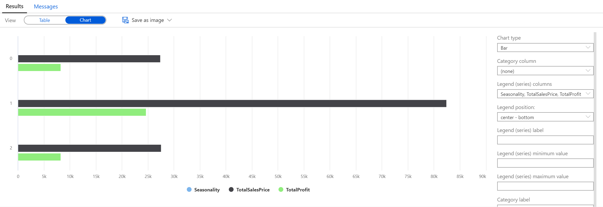

<div class="MCWHeader1">
Azure Synapse Analytics and AI
</div>

<div class="MCWHeader2">
Hands-on lab step-by-step
</div>

<div class="MCWHeader3">
May 2022
</div>


© 2021 Microsoft Corporation. All rights reserved.

Microsoft and the trademarks listed at <https://www.microsoft.com/en-us/legal/intellectualproperty/Trademarks/Usage/General.aspx> are trademarks of the Microsoft group of companies. All other trademarks are property of their respective owners.

## Solution architecture


## Resource naming throughout this lab

For the remainder of this lab, the following terms will be used for various ASA (Azure Synapse Analytics) related resources (make sure you replace them with actual names and values from your environment):

| Azure Synapse Analytics Resource  | To be referred to                                                                  |
|-----------------------------------|------------------------------------------------------------------------------------|
| Azure Subscription                | `WorkspaceSubscription`                                                            |
| Azure Region                      | `WorkspaceRegion`                                                                  |
| Workspace resource group          | `WorkspaceResourceGroup`                                                           |
| Workspace / workspace name        | `asaworkspace{suffix}`                                                             |
| Primary Storage Account           | `asadatalake{suffix}`                                                              |
| Default file system container     | `DefaultFileSystem`                                                                |
| SQL Pool                          | `SqlPool01`                                                                        |
| SQL Serverless Endpoint           | `SqlServerless01`                                                                  |
| Azure Key Vault                   | `asakeyvault{suffix}`    |

# Exercise 3: Exploring raw text-based data with Azure Synapse SQL Serverless

**Duration**: 15 minutes

A common format for exporting and storing data is with text-based files. These can delimit text files such as CSV as well as JSON structured data files. Azure Synapse Analytics also provides ways of querying into these types of raw files to gain valuable insights into the data without having to wait for them to be processed.

### Task 1: Query CSV data

1. Create a new SQL script by selecting **Develop** from the left menu, then in the **Develop** blade, expanding the **+** button and selecting **SQL script**.

2. Ensure **Built-in** is selected in the **Connect to** dropdown list above the query window.

    

3. In this scenario, we will be querying into the CSV file that was used to populate the product table. This file is located in the `asadatalake{SUFFIX}` account at: **wwi-02/data-generators/generator-product.csv**. We will select all data from this file. Copy and paste the following query into the query window and select **Run** from the query window toolbar menu. Remember to replace `asadatalake{SUFFIX}` with your storage account name.

    ```sql
    SELECT
       csv.*
    FROM
        OPENROWSET(
            BULK 'https://asadatalake{SUFFIX}.dfs.core.windows.net/wwi-02/data-generators/generator-product/generator-product.csv',
            FORMAT='CSV',
            FIRSTROW = 1
        ) WITH (
            ProductID INT,
            Seasonality INT,
            Price DECIMAL(10,2),
            Profit DECIMAL(10,2)
        ) as csv
    ```

    > **Note**: In this query we are querying only a single file. Azure Synapse Analytics allows you to query across a series of CSV files (structured identically) by using wildcards in the path to the file(s).

4. You are also able to perform aggregations on this data. Replace the query with the following, and select **Run** from the toolbar menu. Remember to replace `asadatalake{SUFFIX}` with your storage account name.

    ```sql
    SELECT
        Seasonality,
        SUM(Price) as TotalSalesPrice,
        SUM(Profit) as TotalProfit
    FROM
        OPENROWSET(
            BULK 'https://asadatalake{SUFFIX}.dfs.core.windows.net/wwi-02/data-generators/generator-product/generator-product.csv',
            FORMAT='CSV',
            FIRSTROW = 1
        ) WITH (
            ProductID INT,
            Seasonality INT,
            Price DECIMAL(10,2),
            Profit DECIMAL(10,2)
        ) as csv
    GROUP BY
        csv.Seasonality
    ```

5. After you have run the previous query, switch the view on the **Results** tab to **Chart** to see a visualization of the aggregation of this data. Feel free to experiment with the chart settings to obtain the best visualization!

    

6. At the far right of the top toolbar, select the **Discard all** button as we will not be saving this query. When prompted, choose to **Discard changes**.

   

### Task 2: Query JSON data

1. Create a new SQL script by selecting **Develop** from the left menu, then in the **Develop** blade, expanding the **+** button and selecting **SQL script**.

2. Ensure **Built-in** is selected in the **Connect to** dropdown list above the query window.

    

3. Replace the query with the following, remember to replace `asadatalake{SUFFIX}` with the name of your storage account:

    ```sql
    SELECT
        products.*
    FROM
        OPENROWSET(
            BULK 'https://asadatalake{SUFFIX}.dfs.core.windows.net/wwi-02/product-json/json-data/*.json',
            FORMAT='CSV',
            FIELDTERMINATOR ='0x0b',
            FIELDQUOTE = '0x0b',
            ROWTERMINATOR = '0x0b'
        )
        WITH (
            jsonContent NVARCHAR(200)
        ) AS [raw]
    CROSS APPLY OPENJSON(jsonContent)
    WITH (
        ProductId INT,
        Seasonality INT,
        Price DECIMAL(10,2),
        Profit DECIMAL(10,2)
    ) AS products
    ```

4. At the far right of the top toolbar, select the **Discard all** button as we will not be saving this query. When prompted, choose to **Discard changes**.

   
