<div class="MCWHeader1">
Azure Synapse Analytics and AI
</div>

<div class="MCWHeader2">
Hands-on lab step-by-step
</div>

<div class="MCWHeader3">
May 2022
</div>


© 2021 Microsoft Corporation. All rights reserved.

Microsoft and the trademarks listed at <https://www.microsoft.com/en-us/legal/intellectualproperty/Trademarks/Usage/General.aspx> are trademarks of the Microsoft group of companies. All other trademarks are property of their respective owners.

## Solution architecture

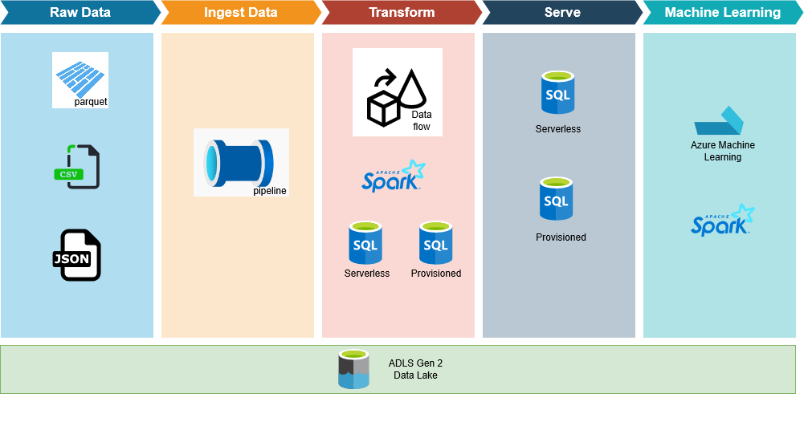


## Resource naming throughout this lab

For the remainder of this lab, the following terms will be used for various ASA (Azure Synapse Analytics) related resources (make sure you replace them with actual names and values from your environment):

| Azure Synapse Analytics Resource  | To be referred to                                                                  |
|-----------------------------------|------------------------------------------------------------------------------------|
| Azure Subscription                | `WorkspaceSubscription`                                                            |
| Azure Region                      | `WorkspaceRegion`                                                                  |
| Workspace resource group          | `WorkspaceResourceGroup`                                                           |
| Workspace / workspace name        | `asaworkspace{suffix}`                                                             |
| Primary Storage Account           | `asadatalake{suffix}`                                                              |
| Default file system container     | `DefaultFileSystem`                                                                |
| SQL Pool                          | `SqlPool01`                                                                        |
| SQL Serverless Endpoint           | `SqlServerless01`                                                                  |
| Azure Key Vault                   | `asakeyvault{suffix}`    |


# Exercise 7: Introspecting Synapse Workspace data with Azure Purview (Optional)

**Duration**: 40 minutes

Azure Purview is a unified data governance service that helps manage and govern on-premises, multi-cloud, and software-as-a-service (SaaS) data. Azure Purview discovers, classifies, catalogs, and documents data creating a holistic, up-to-date map of your data landscape in an automated fashion.

In this exercise, we'll create an Azure Purview resource and scan the Synapse Analytics workspace. Then, we'll integrate Purview with Azure Synapse Analytics to view the data lineage of a pipeline run.

### Task 1: Create an Azure Purview resource

1. In the Azure Portal, open the lab resource group. Select **+ Create** in the toolbar menu.

2. In the search box, enter and select **Azure Purview**. Select **Create**.

3. On the **Create Purview account**, fill the form as follows, then select **Review + Create**. Select **Create** on the validation screen.

    | Field | Value |
    |-------|-------|
    | Subscription | Select the lab subscription. |
    | Resource group | Select the lab resource group. |
    | Purview account name | Enter `wwidata{SUFFIX}`. |
    | Location | Select the lab region. |
    | Managed resource group name | Enter `purview-rg`. |

    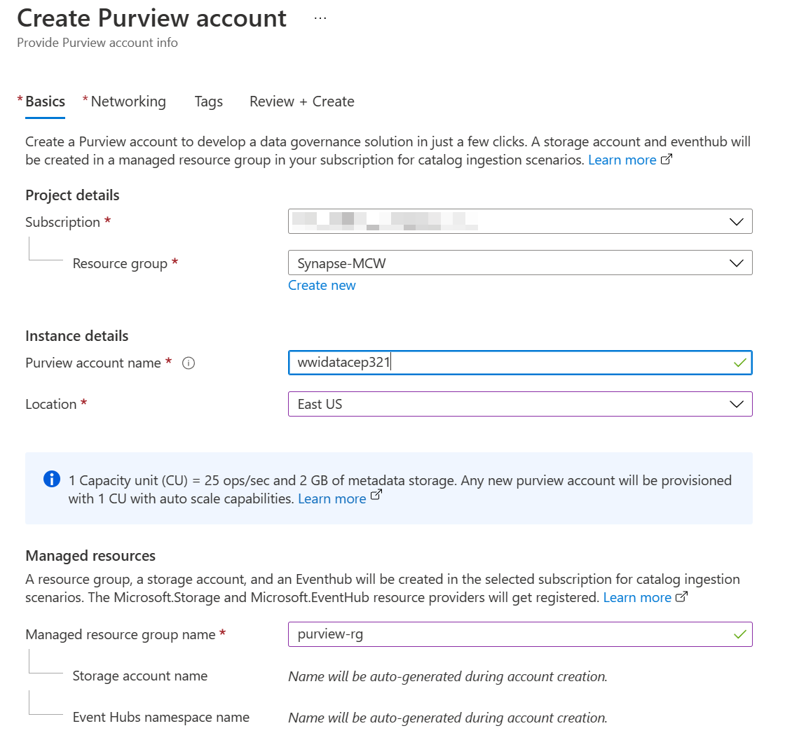

### Task 2: Register the Azure Synapse Analytics workspace as a data source

1. Once deployment completes, open the Azure Purview resource that was created in the previous task.

2. From the Purview account Overview screen, select the **Open Purview Studio** card.

   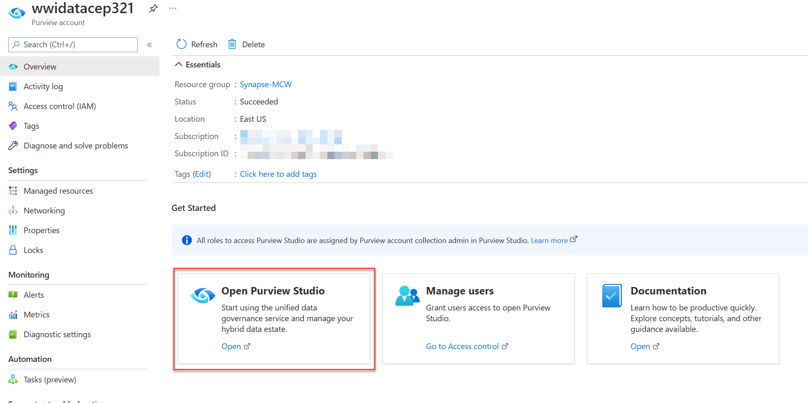

3. From the left menu, select **Data map**, then ensure the **Sources** item is selected. Choose the **Register** button in the toolbar menu.

    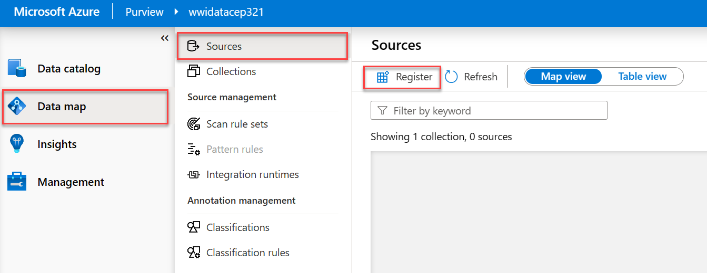

4. In the Register sources blade, search for and select **Azure Synapse Analytics**. Select **Continue**.

   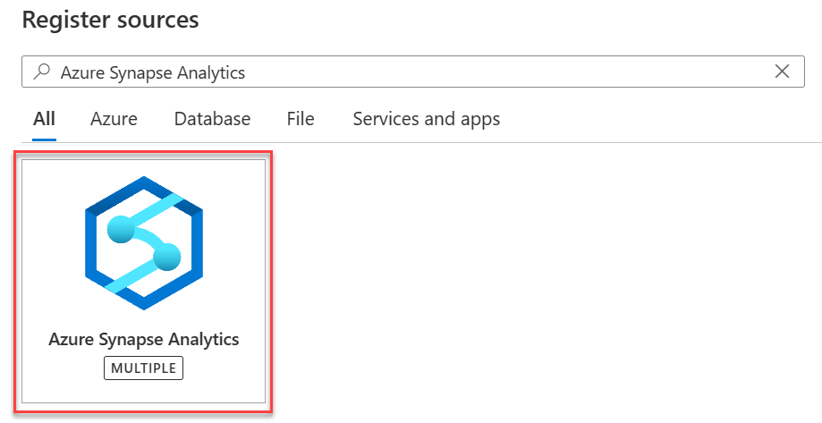

5. In the **Register sources (Azure Synapse Analytics)** form, fill the form as follows, then select **Register**.

    | Field | Value |
    |-------|-------|
    | Name | Enter `asaworkspace{SUFFIX}`. |
    | Azure subscription | Select the lab subscription. |
    | Workspace name | Select **asaworkspace{SUFFIX}**. |
    | Dedicated SQL endpoint | Retain the default value. |
    | Serverless SQL endpoint | Retain the default value. |
    | Select a collection | Retain the default value (Root). |

    ")

6. Notice how the Map view of the data sources now includes the Azure Synapse Analytics workspace.

    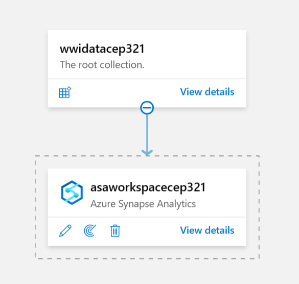

### Task 3: Grant the Azure Purview Managed Identity the required permissions to Azure Synapse Analytics assets

1. In the Azure Portal, open the Azure Synapse Analytics resource screen (asaworkspace{SUFFIX}).

2. From the left menu, select **Access control (IAM)**.

3. Expand the **+ Add** toolbar item, and select **Add role assignment**.

4. From the list of roles, select **Reader**, then select **Next**.

5. On the **Members** tab, select **Managed identity** for the **Assign access to** field. Then, select **+ Select members**.

    

6. On the **Select managed identities** blade, select **Purview account** for the Managed identity field. Then, select the **wwidata{SUFFIX}** Purview account that you created earlier. Choose **Select**.

7. On the **Add role assignment** screen, select **Review + assign**.

8. Remaining on the Synapse workspace resource screen in the Azure Portal, select **Networking** from the left menu.

9. Check the **Allow Azure services and resources to access this workspace**, then select **Save** from the toolbar menu.

    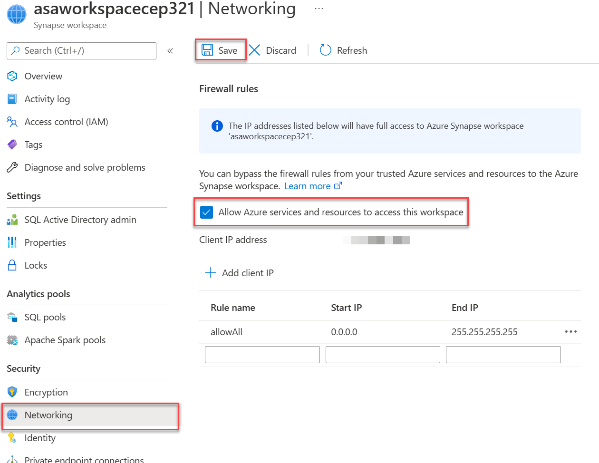

10. In the Azure Portal, open the lab resource group. Locate and select the **asadatalake{SUFFIX}** storage account.

11. Following steps 3-7 but this time grant the **Storage blob data reader** role to the Azure Purview managed identity.

12. Return to Synapse Studio. Select the **Data** hub. Expand the actions menu next to the **SQLPool01** node and select **New SQL script**, then **Empty script**.

    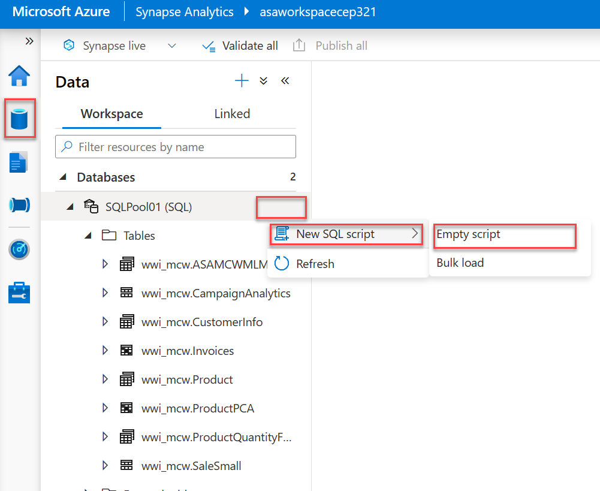

13. Run the following query to add the Azure Purview account MSI (represented by the account name) as db_datareader on the dedicated SQL database. Remember to replace `{SUFFIX}` in the script below with your value.

    ```SQL
    CREATE USER [wwidata{SUFFIX}] FROM EXTERNAL PROVIDER
    GO

    EXEC sp_addrolemember 'db_datareader', [wwidata{SUFFIX}]
    GO
    ```

### Task 4: Set up a scan of the Azure Synapse Analytics dedicated SQL Pool

1. Return to Purview studio.

2. Select **Data map** from the left menu.

3. Select the **View details** link on the **asaworkspace{SUFFIX}** card in the Map view.

    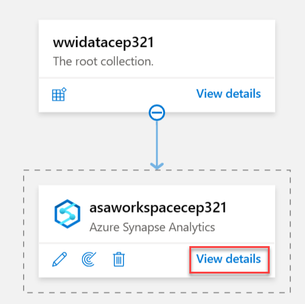

4. On the **asaworkspace{SUFFIX}** data source details screen, select **New scan** from the toolbar menu.

   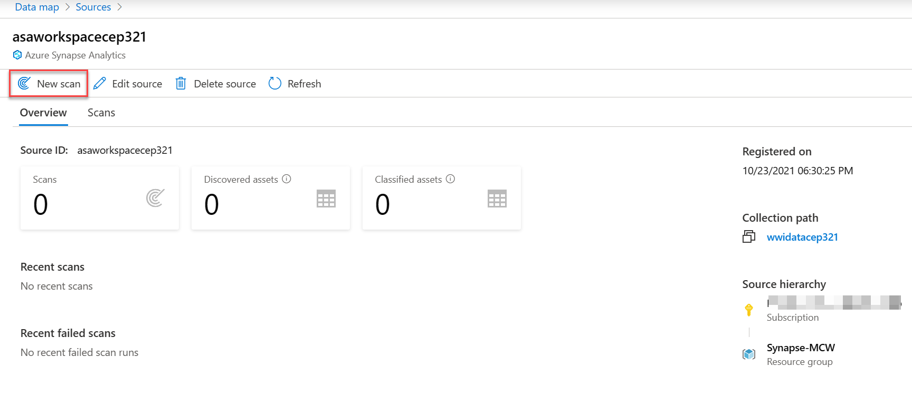

5. On the **Scan** blade, name the scan **Scan-SQLPool01**. Ensure **SQLPool01** is selected. It is safe to ignore the error regarding the serverless databases. Select **Continue**.

    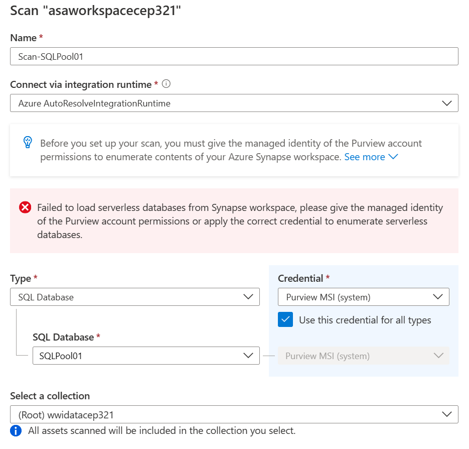

6. Once the scan validates (displays a Success with a green check mark), select **Continue** once again.

7. On the **Select a scan rule set** blade, select **AzureSynapseSQL**, then **Continue**.

    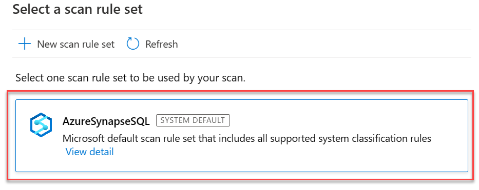

8. On the **Set a scan trigger** blade, select **Once**, then **Continue**.

9. On the **Review your scan** blade, select **Save and run**.

10. The scan will take approximately 8 minutes to queue and run. Feel free to refresh the data source details page to see the latest statistics from the scan.

    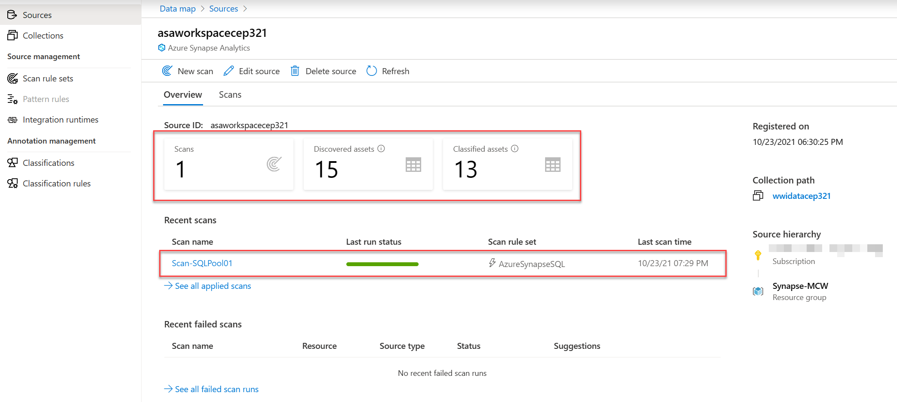

### Task 5: Review the results of the scan in the data catalog

1. In Purview Studio, select **Data catalog** from the left menu, then select the **Browse assets** card.

    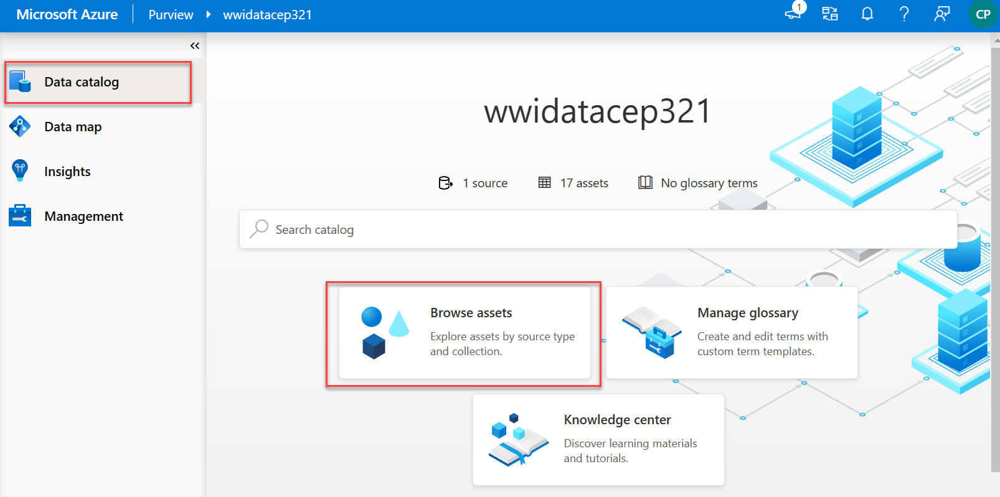

2. In the **Browse assets** screen, select the **wwidata{SUFFIX}** root collection.

3. The **Browse assets** will now display the discovered entities. Feel free to select one or more items and view their respective schemas. Also note that Country/Region, Email address and U.S. Phone Number classifications are available as a filter.

    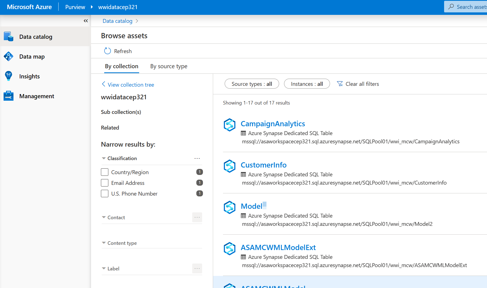

### Task 6: Integrate Purview with Azure Synapse Analytics

1. In Purview Studio, select **Data map** from the left menu. Select **Collections** from the middle menu, and ensure the **wwidata{SUFFIX}** collection is selected in the listing. On the **wwidata{SUFFIX}** collection screen, select the **Role assignments** tab.

    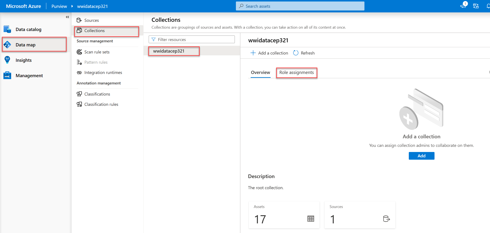

2. Next to the **Data curators** role, select the **Add data curators** button.

    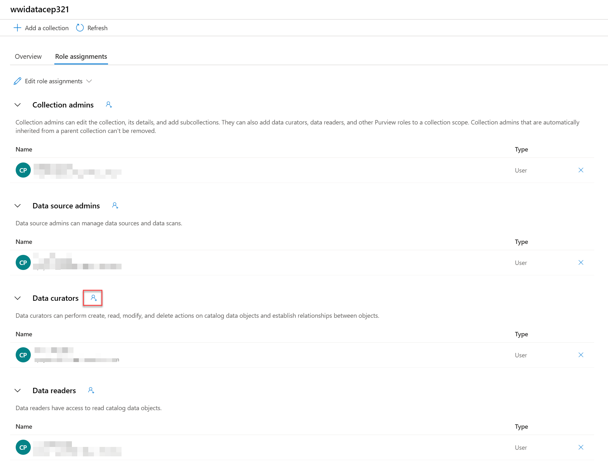

3. In the **Add or remove data curators** blade, search for and select the Azure Synapse Workspace, `asaworkspace{SUFFIX}`. Select **OK**.

    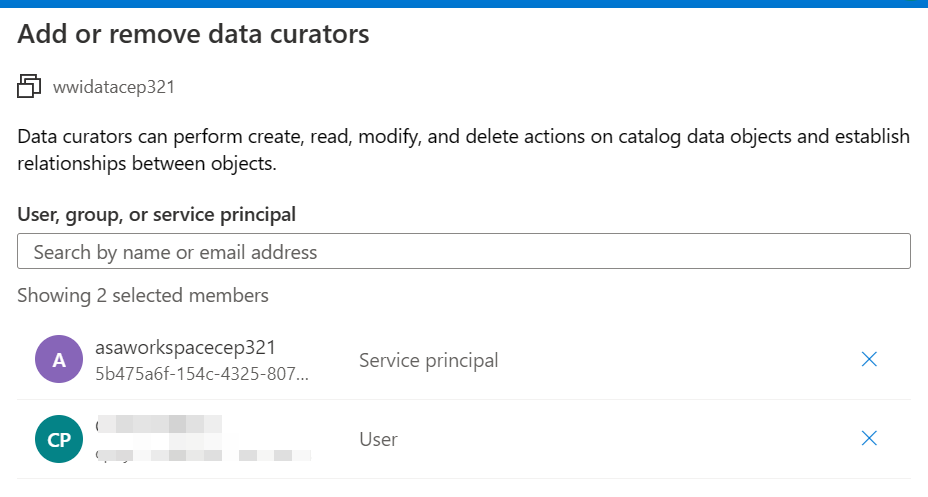

4. In Synapse Studio, select the **Manage** hub, then choose **Azure Purview** from the center menu. On the Azure Purview screen, select **Connect to a Purview account**.

    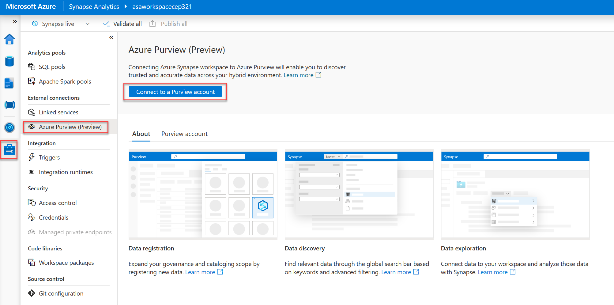

5. In the **Connect to a Purview account** blade, select **From Azure subscription** and the **wwidata{SUFFIX}** Purview account. Select **Apply**.

    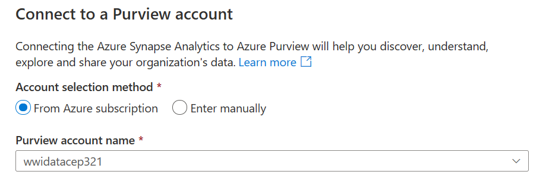

6. On the **Azure Purview** screen, select the **Purview account** tab. Notice how the **Data Lineage - Synapse Pipeline** integration is now connected.

    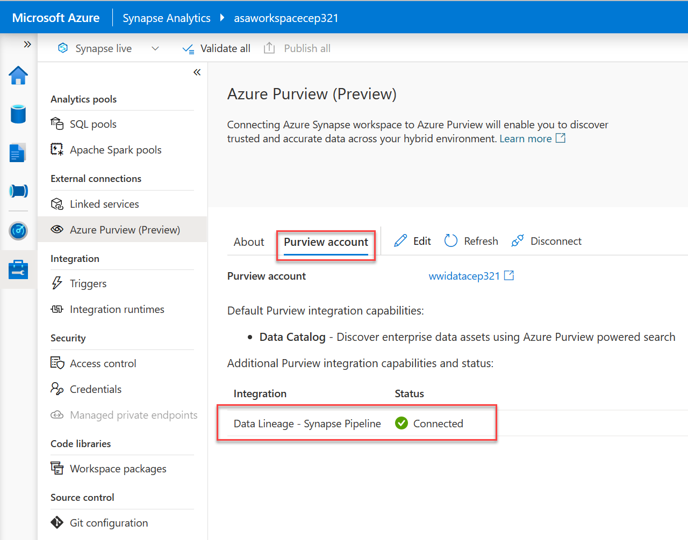

### Task 7: Observe Synapse Pipeline data lineage information in Azure Purview

1. To view this integration in action, select the **Integrate** hub, expand the **Pipelines** and open the **ASAMCW - Exercise 2 - Copy Campaign Analytics Data** pipeline. From the top toolbar menu, expand **Add trigger** and select **Trigger now**. On the **Pipeline run** blade, select **OK** to kick off the run.

2. Select the **Monitor** hub, wait for the pipeline run to complete, then select it to view the details of the run.

3. Data lineage is captured and pushed to the Purview account when the pipeline activity entails a COPY activity or a Data Flow. In the case of the Campaign Analytics data pipeline, it has a data flow. Select the **Lineage status** icon next to the **Data flow1** activity to see the result. It should state the status of **Succeeded**.

    

4. Return to Purview Studio, select **Data catalog**, then choose the **Browse assets** card.

5. On the **Browse assets** screen, select the **By source type** tab, then choose **Azure Synapse Analytics**.

    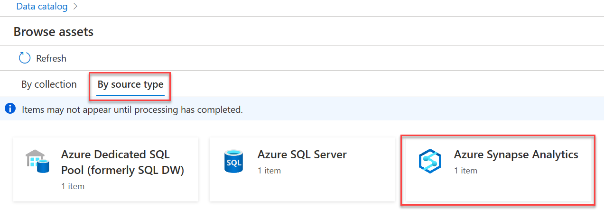

6. Select the **asaworkspace{SUFFIX}** workspace.

7. A tree-view is rendered that includes the Campaign Analytics pipeline that we just ran. Select the **ASAMCW - Exercise 2 - Copy Campaign Analytics Data** pipeline from the tree-view.

    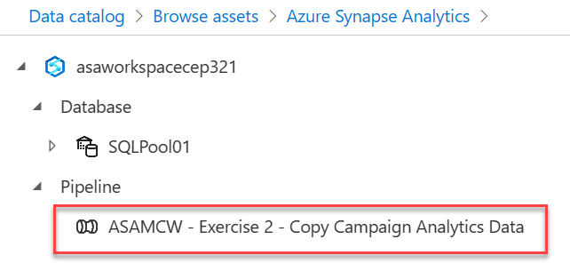

8. Select **Data flow1** from the list of activities of the pipeline.

9. On the **Data flow1** details screen, select the **Lineage** tab. You can now visually see the source of the data was from the campaignanalytics.csv file and was destined for the CampaignAnalytics dedicated SQL Pool table.

    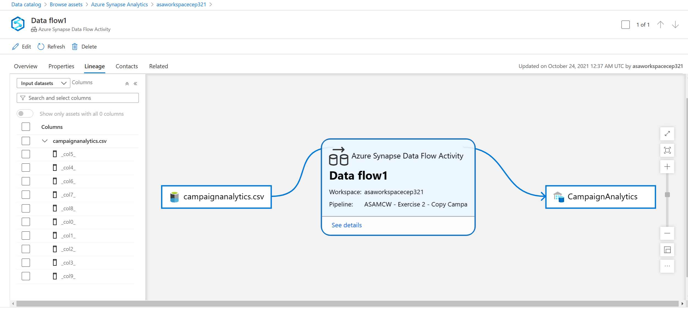
