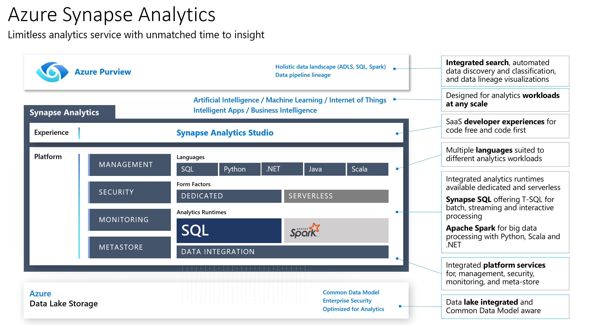

# Azure Synapse Analytics and AI - Hackathon 

Wide World Importers (WWI) has hundreds of brick-and-mortar stores and an online store where they sell a variety of products. They would like to gain business insights using historical, real-time, and predictive analytics using structured and unstructured data sources. In doing so, they want to enable their IT team of data engineers and data scientists to bring in and run complex queries over petabytes of structured data with billions of rows and unstructured enterprise operational data. At the same time, they want to enable business analysts and their IT team to share a single source of truth and have a single workspace to collaborate and work with enterprise data and enriched customer data. They want to accomplish this by minimizing the number of disparate services they use across ingest, transformation, querying, and storage so that their team of data engineers, data scientists, and database administrators can master one tool, and can build shared best practices for development, management, and monitoring.

May 2022

## Target audience

- Data engineer
- Business Analyst 
- Data scientist

# Abstracts

### Workshop

In this workshop, you will look at the process of creating an end-to-end solution using Azure Synapse Analytics. The workshop will cover data loading, data preparation, data transformation, and data serving, along with performing machine learning and handling both batch and real-time data.

At the end of this whiteboard design session, you will be better able to design and build a complete end-to-end advanced analytics solution using Azure Synapse Analytics.

### Architecture design overview

In this Session we are going to review the architecture design of the end-to-end solution we will be implementing in the Hands-on lab. 

**Infographic for common scenarios**

### Hands-on lab

In this hands-on lab, you will build end-to-end data analytics with a machine learning solution using Azure Synapse Analytics. The information will be presented in the context of a retail scenario. We will be heavily leveraging Azure Synapse Studio, a tool that conveniently unifies the most common data operations from ingestion, transformation, querying, and visualization.

**Exercise**
1. Exercise 0 
    - [Setup the Analytics environment](https://github.com/catwang42/Synapse-One-Day-Hackathon/blob/main/Hands-on%20lab/Before%20the%20Lab%20-%20Azure%20Synapse%20Analytics%20and%20AI.md)
    - [Setup the Advanced environment](https://github.com/catwang42/Synapse-One-Day-Hackathon/blob/main/Hands-on%20lab/Before%20the%20Lab%20-%20Advanced%20Setup%20Environment.md)
2. Exercise 1 - Ingest data from source 
    - IAM, assign roles, set up linked service 
    - Land data in Data lake
    - set up analytics resources
    - Ingesting data into Stage 1 (extract and landing )
3. Exercise 2 - Explore data in Data Lake 
    - Query Data lake using serverless SQL (parquet, csv, json)
    - Query Data lake using Spark
4. Exercise 3 - Load data in SQL pools and run Analysis 
    - Ingesting data into stage 2
    - Incremental loads , delta load , snapshot load (spark)
    - Create managed table and populate the tables 
    - Using dataflow to transform the data
    - Processing data in stage 2
5. Exercise 4 - Security 
    - Column level security
    - Row level security
    - Dynamic data masking
5. Exercise 5 - Power BI Integration
    - Link power BI 
    - Create your first Visuals 
6. Exercise 6 - Monitoring 
    - Workload Importance
    - Workload Isolation
    - Monitoring with Dynamic Management views
7. Exercise 7 - ML (Optional)
    - Using AutoML to train your first machien learning model and consume the result in PowerBI 

## Azure services and related products

- Azure Synapse Analytics
- Azure Storage and Azure Data Lake gen 2
- Azure Machine Learning
- Azure Purview
- Power BI

## Additional references

| **Description**                                             | **Links**                                                                                                                                                                                                                                                                         |
|-------------------------------------------------------------|-----------------------------------------------------------------------------------------------------------------------------------------------------------------------------------------------------------------------------------------------------------------------------------|
| What is Azure Synapse Analytics                             | <https://docs.microsoft.com/en-us/azure/synapse-analytics/sql-data-warehouse/sql-data-warehouse-overview-what-is>                                                                                                                                                                 |
| Cheat sheet for Azure Synapse Analytics solutions           | <https://docs.microsoft.com/en-us/azure/synapse-analytics/sql-data-warehouse/cheat-sheet>                                                                                                                                                                                         |
| Azure Synapse Analytics FAQ                                 | <https://docs.microsoft.com/en-us/azure/synapse-analytics/sql-data-warehouse/sql-data-warehouse-overview-faq>                                                                                                                                                                     |
| Advanced data security for Azure SQL Database               | <https://docs.microsoft.com/en-us/azure/sql-database/sql-database-advanced-data-security?toc=/azure/synapse-analytics/sql-data-warehouse/toc.json&bc=/azure/synapse-analytics/sql-data-warehouse/breadcrumb/toc.json>                                                             |
| Private link for Azure SQL DB and Data Warehouse            | <https://docs.microsoft.com/en-us/azure/sql-database/sql-database-private-endpoint-overview?toc=/azure/synapse-analytics/sql-data-warehouse/toc.json&bc=/azure/synapse-analytics/sql-data-warehouse/breadcrumb/toc.json>                                                          |
| Column-level security                                       | <https://docs.microsoft.com/en-us/azure/synapse-analytics/sql-data-warehouse/column-level-security>                                                                                                                                                                               |
| Row-level security                                          | <https://docs.microsoft.com/en-us/sql/relational-databases/security/row-level-security?toc=%2Fazure%2Fsynapse-analytics%2Fsql-data-warehouse%2Ftoc.json&bc=%2Fazure%2Fsynapse-analytics%2Fsql-data-warehouse%2Fbreadcrumb%2Ftoc.json&view=sql-server-ver15>                       |
| Dynamic Data Masking                                        | <https://docs.microsoft.com/en-us/azure/sql-database/sql-database-dynamic-data-masking-get-started?toc=%2Fazure%2Fsynapse-analytics%2Fsql-data-warehouse%2Ftoc.json&bc=%2Fazure%2Fsynapse-analytics%2Fsql-data-warehouse%2Fbreadcrumb%2Ftoc.json&view=sql-server-ver15>           |
| Transparent Data Encryption                                 | <https://docs.microsoft.com/en-us/azure/sql-database/transparent-data-encryption-azure-sql?toc=%2Fazure%2Fsynapse-analytics%2Fsql-data-warehouse%2Ftoc.json&bc=%2Fazure%2Fsynapse-analytics%2Fsql-data-warehouse%2Fbreadcrumb%2Ftoc.json&view=sql-server-ver15&tabs=azure-portal> |
| JSON Functions                                              | <https://docs.microsoft.com/en-us/sql/t-sql/functions/json-functions-transact-sql?toc=%2Fazure%2Fsynapse-analytics%2Fsql-data-warehouse%2Ftoc.json&bc=%2Fazure%2Fsynapse-analytics%2Fsql-data-warehouse%2Fbreadcrumb%2Ftoc.json&view=sql-server-ver15>                            |
| Result set caching                                          | <https://docs.microsoft.com/en-us/azure/synapse-analytics/sql-data-warehouse/performance-tuning-result-set-caching?view=sql-server-ver15>                                                                                                                                         |
| Overview of Tables in Synapse Analytics                     | <https://docs.microsoft.com/en-us/azure/synapse-analytics/sql-data-warehouse/sql-data-warehouse-tables-overview?view=sql-server-ver15>                                                                                                                                            |
| Workload Management                                         | <https://docs.microsoft.com/en-us/azure/synapse-analytics/sql-data-warehouse/sql-data-warehouse-workload-management?view=sql-server-ver15>                                                                                                                                        |
| Intro to Azure Data Lake Store Gen2                         | <https://docs.microsoft.com/en-us/azure/storage/blobs/data-lake-storage-introduction>                                                                                                                                                                                             |
| Azure Stream Analytics                                      | <https://docs.microsoft.com/en-us/azure/stream-analytics/stream-analytics-introduction>                                                                                                                                                                                           |
| Azure Purview Data Catalog lineage user guide               | https://docs.microsoft.com/en-us/azure/purview/catalog-lineage-user-guide                                                                                                                                                                                                         |
| Asset insights on your data in Azure Purview                | https://docs.microsoft.com/en-us/azure/purview/asset-insights                                                                                                                                                                                                                     |
| Sensitivity label insights about your data in Azure Purview | https://docs.microsoft.com/en-us/azure/purview/sensitivity-insights                                                                                                                                                                                                               |
| Azure Purview | <https://azure.microsoft.com/en-us/services/purview/> |
| Azure Purview - Map, Discover, and Find Insights Across Data Sources | <https://youtu.be/27bA4KFiEKk> |
| Azure Synapse Link for Dataverse | <https://docs.microsoft.com/en-us/powerapps/maker/data-platform/export-to-data-lake> |
| MCW Cosmos DB Real-Time Advanced Analytics (Synapse Link for Cosmos DB) | <https://github.com/Microsoft/MCW-Cosmos-DB-Real-Time-Advanced-Analytics> |
| Query Delta Lake files using serverless SQL pool in Azure Synapse Analytics | <https://docs.microsoft.com/en-us/azure/synapse-analytics/sql/query-delta-lake-format> |
